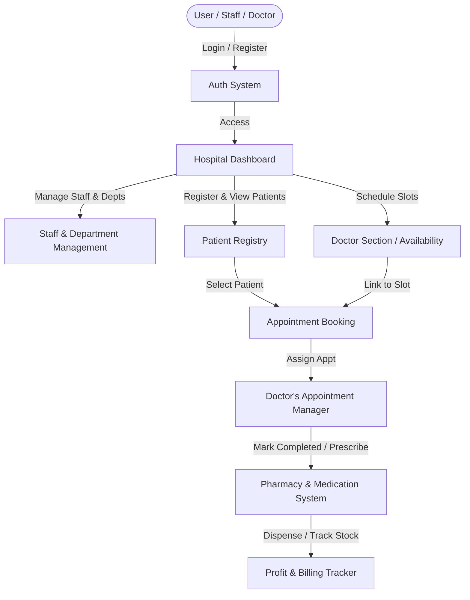

# 🏥 HALE — Hospital Management System

[](https://www.python.org/)
[](https://www.djangoproject.com/)
[](https://www.sqlite.org/)
[](https://github.com/fabiocaccamo/django-admin-interface)

A Django-based hospital management web application designed for internal administration, doctor schedules, patient registration, appointment booking, pharmacy operations, and financial auditing.

---

## 📋 Table of Contents

- [✨ Features](#-features)
- [🛠️ Technology Stack](#%EF%B8%8F-technology-stack)
- [📐 System Architecture](#-system-architecture)
- [🚀 Getting Started](#-getting-started)
  - [Prerequisites](#prerequisites)
  - [Installation & Setup](#installation--setup)
  - [Running the App](#running-the-app)
- [📂 Project Structure](#-project-structure)
- [🔗 URL & Routing Guide](#-url--routing-guide)
- [⚙️ Important Configuration](#%EF%B8%8F-important-configuration)
- [💎 Customization & Styling](#-customization--styling)

---

## ✨ Features

- 🔑 **User Authentication**: Secure login, registration, and logout system for hospital personnel.
- 👨‍⚕️ **Doctor & Slot Management**: Create, update, and delete doctor availability blocks (operation slots, breaks, departments).
- 🩺 **Patient Registry**: Patient registration forms, record search/filtering (via name, age, phone, or address), and medical history cards.
- 📅 **Appointment Scheduler**: Link patients to doctor slots, track prescription notes, and mark appointments as completed.
- 💊 **Pharmacy Inventory**: Medication stock management (pricing, description, category, expiry, and quantity tracking) with automated profit accounting.
- 📊 **Finance & Accounting**: Revenue tracking showing profits made from medical sales vs. doctor appointment fees.
- ✉️ **SMTP Feedback Service**: Automatic email notifications sent to patients upon submitting feedback using Google SMTP.
- 🖨️ **Printable Invoices**: Built-in printer-friendly styles for generating PDF or physical billing sheets.

---

## 🛠️ Technology Stack

| Technology / Library | Version | Purpose |
| :--- | :--- | :--- |
| **Python** | `3.10+` | Core programming language |
| **Django** | `5.0.1` | High-level Python Web Framework |
| **django-admin-interface** | `0.28.3` | Customizes the Django Admin panel into a modern dashboard |
| **django-colorfield** | `0.11.0` | Helper package for custom colors in the Admin panel |
| **SQLite** | `Built-in` | Standard development database |

---

## 📐 System Architecture

The workflow of HALE is centered around the core `DashBoard_app` package and a central database configuration:



---

## 🚀 Getting Started

Follow these instructions to set up the project locally on your system.

### Prerequisites

Ensure you have the following installed:
- **Python 3.10 or higher**
- **pip** (Python package installer)

### Installation & Setup

1. **Clone or Extract the Project Files**
   Navigate to the directory of the project:
   ```powershell
   cd c:\Users\rahul\Downloads\hale_project\hale_project
   ```

2. **Create a Clean Virtual Environment**
   Remove the previous virtual environment directory if it is broken, and recreate a new one:
   ```powershell
   # On Windows (PowerShell/CMD):
   Remove-Item -Recurse -Force virt -ErrorAction SilentlyContinue
   python -m venv virt
   ```

3. **Activate the Virtual Environment**
   ```powershell
   # PowerShell:
   .\virt\Scripts\activate
   
   # CMD:
   .\virt\Scripts\activate.bat
   ```

4. **Install Dependencies**
   Use the `requirements.txt` file to install all compatible packages:
   ```powershell
   pip install -r requirements.txt
   ```

5. **Apply Database Migrations**
   Initialize database tables:
   ```powershell
   python Hale_project/manage.py migrate
   ```

6. **Create a Superuser**
   Create an administrator account to log into the Django Admin dashboard:
   ```powershell
   python Hale_project/manage.py createsuperuser
   ```

### Running the App

Start the Django development server:
```powershell
python Hale_project/manage.py runserver
```

Once running, access the project via:
- **Application URL**: [http://127.0.0.1:8000/](http://127.0.0.1:8000/)
- **Django Admin Panel**: [http://127.0.0.1:8000/admin/](http://127.0.0.1:8000/admin/)

---

## 📂 Project Structure

```text
hale_project/
├── Hale_project/                 # Main Django Project Directory
│   ├── DashBoard_app/            # Main application directory
│   │   ├── migrations/           # Database migration files
│   │   ├── static/               # CSS, JS, images, font files
│   │   ├── templates/            # HTML views (home, patient, medication, etc.)
│   │   ├── admin.py              # Admin panel setups for models
│   │   ├── models.py             # App Models (Staff, Medicine, Patient, Appointments)
│   │   ├── urls.py               # Route handlers
│   │   └── views.py              # Controller & dashboard views logic
│   ├── Hale_project/             # Configuration folder
│   │   ├── settings.py           # Core settings (Database, Email SMTP, Apps)
│   │   ├── urls.py               # Main URL router delegation
│   │   └── wsgi.py / asgi.py     # Deployment entry-points
│   ├── db.sqlite3                # SQLite database file
│   └── manage.py                 # Django CLI management script
├── virt/                         # Local python virtual environment (excluded from git)
├── requirements.txt              # Standard package requirements
└── README.md                     # Documentation
```

---

## 🔗 URL & Routing Guide

| Path | View | Description |
| :--- | :--- | :--- |
| `/` | `views.home` | Landing / welcome page |
| `/login/` | `views.login` | Authentication page |
| `/register/` | `views.register` | Account creation page |
| `/dashboard/` | `views.dashboard` | Portal central panel |
| `/doctor/` | `views.addsection` | Set and view doctor availability slots |
| `/patient/` | `views.patient` | Dashboard view for patient control |
| `/reg_patient/` | `views.reg_patient` | Register a new patient profile |
| `/reg_view_patient/` | `views.reg_view_patient` | View and search patient directory |
| `/appointment/` | `views.main_appointment` | General slot lists and scheduling dashboard |
| `/medicine/` | `views.medicine` | Physician view to prescribe drugs to patients |
| `/addmed/` | `views.addmed` | Add new medicine configurations |
| `/Accounting/` | `views.Accounting` | Profit and billing reporting panel |

---

## 🌐 Remote Access & OP Counter Logic

### Remote Access (Port Forwarding Setup)
To access HALE from home or other networks outside your local router:
1. **Port Forwarding**: Set up your home router to forward incoming traffic (e.g., port `8000`) to your local machine's private IP address on the same port.
2. **Django Bind Address**: Start the server bound to all interfaces so it listens for external connection requests:
   ```powershell
   python Hale_project/manage.py runserver 0.0.0.0:8000
   ```
3. **Allowed Hosts**: In `Hale_project/Hale_project/settings.py`, modify `ALLOWED_HOSTS` to include your public IP address or your custom dynamic DNS domain name:
   ```python
   ALLOWED_HOSTS = ['your-public-ip-or-domain', '127.0.0.1', 'localhost']
   # For quick testing only: ALLOWED_HOSTS = ['*']
   ```

### OP Counter Logic
* **Slot-based Limits**: Doctors define operational OP limits (`sec_op_no`) when creating availability slots in the doctor panel (`/doctor/`). This value is validated against the department's max capacity (`dept_op_nos`).
* **Static Allocation**: The OP counter represents the maximum allocated ticket or queue capacity for that specific scheduled slot block.
* **Note on Live Queues**: The app currently registers and displays these token/OP numbers statically. It **does not** include a real-time ticking queue display (e.g. "Now serving token X") out of the box.

---

## ⚙️ Important Configuration

> [!IMPORTANT]
> **Production Safety Checklist:**
> 1. In `settings.py`, toggle `DEBUG = False` before public deployment.
> 2. Generate a custom, secure `SECRET_KEY` and do not hardcode it in Git.
> 3. Add permitted domains or hostnames under `ALLOWED_HOSTS`.

### Email Settings
The system uses Django's SMTP backend. Current credentials in `settings.py` (Gmail configuration):
```python
EMAIL_BACKEND = 'django.core.mail.backends.smtp.EmailBackend'
EMAIL_HOST = 'smtp.gmail.com'
EMAIL_USE_TLS = True
EMAIL_PORT = 587
EMAIL_HOST_USER = 'djangoemail0000@gmail.com'
EMAIL_HOST_PASSWORD = 'byctfnjqsxnwvhha'  # Replace with environment variable
```
> [!WARNING]
> Keep `EMAIL_HOST_PASSWORD` hidden using environment variables (e.g. `python-dotenv`) in production environments.

---

## 💎 Customization & Styling

- The look and feel of the standard Django admin is modernized via `django-admin-interface` which provides visual customization directly through the database.
- Print media styling is added in the HTML templates to enable clean, margin-free rendering for billing printing pages (`print.html`).
